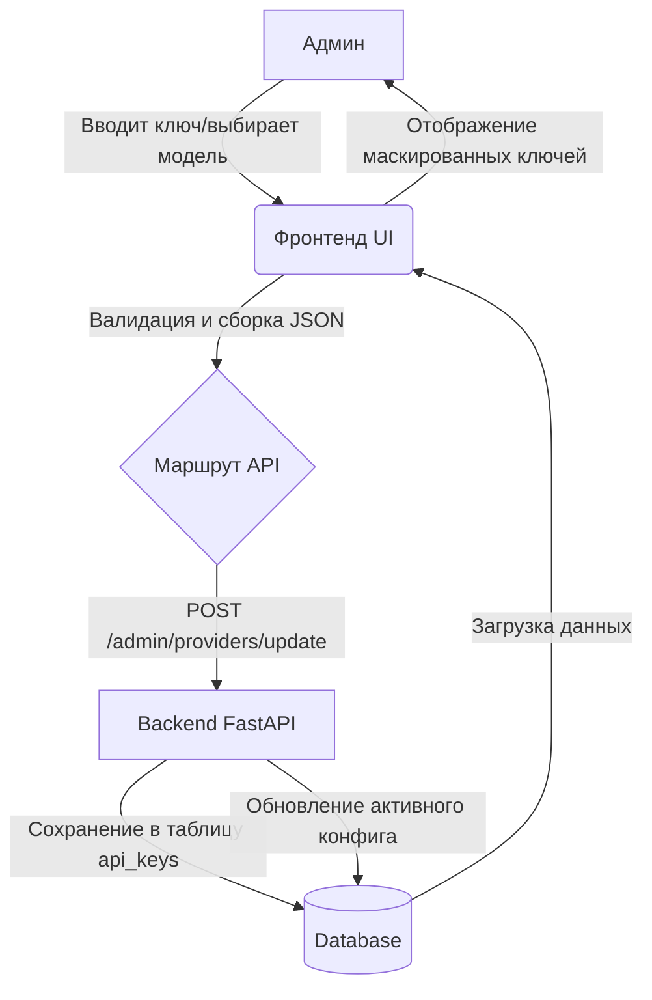

# Техническое задание: Редизайн Админ-интерфейса

## 1. Общие принципы (Design System)
- **Цветовая схема**: Сохранение тёмной темы, но с улучшенной контрастностью и использованием "мягких" теней для карточек.
- **Компоненты**: Использование Bootstrap 5.3 + кастомные стили в [`admin.css`](app/web/static/admin.css).
- **Zero-Code Policy**: Полный отказ от отображения или ввода JSON пользователем. Фронтенд берет на себя парсинг и сборку объектов.
- **Адаптивность**: Переход от тяжелых таблиц к карточкам на мобильных устройствах.

## 2. Страница «Настройка AI провайдеров» ([`providers.html`](app/web/templates/providers.html))

### Текущее состояние:
- Таблица с `textarea` для JSON.

### Новая структура:
1.  **Блок управления (Форма добавления/редактирования)**:
    - Выбор провайдера (OpenAI, Google Gemini, Yandex GPT).
    - Поле ввода API-ключа (тип password) с иконкой "глаза".
    - Выбор моделей (Текстовая, Vision):
        - OpenAI: `gpt-4o`, `gpt-4o-mini`, `o1-preview`.
        - Gemini: `gemini-1.5-pro`, `gemini-1.5-flash`, `gemini-2.0-flash-exp`.
        - Yandex: `yandexgpt-3`, `yandexgpt-3-lite`.
    - Слайдер "Креативность" (отображает `temperature` от 0 до 1 с подсказками).
2.  **Блок "Текущая конфигурация"**:
    - Информационные карточки: "Активный провайдер: Gemini", "Модель: Flash 1.5" и т.д.
3.  **Блок "История и управление ключами"**:
    - Список всех добавленных ключей.
    - Маскирование: `sk-****fA79`.
    - Действия: "Активировать", "Проверить", "Удалить".
    - Статусы: "Активен", "Не работает", "Превышен лимит".

## 3. Страница «Детали заказа» ([`order_detail.html`](app/web/templates/order_detail.html))

### Текущее состояние:
- Дамп `context_json` в теге `<pre>`.
- Технические статусы (`pending`, `completed`).

### Новая структура:
1.  **Карточка заказа**:
    - ID, Дата, Человеческий статус (Badge с цветом).
    - Итоговая стоимость (крупный шрифт).
2.  **Параметры заказа (бывший Context)**:
    - Список пар "Ключ: Значение" в читаемом виде. Например: "Тема: О любви", "Стиль: Маяковский".
    - Если данных нет — блок скрывается.
3.  **Этапы (Stages)**:
    - Таблица с иконками для каждого типа (Стихотворение, Озвучка и т.д.).
    - Перевод статусов:
        - `pending` -> "В ожидании"
        - `processing` -> "В работе"
        - `completed` -> "Готово"
        - `failed` -> "Ошибка"
    - Модальные окна подтверждения для действий "Перезапустить" и "Отменить".

## 4. Необходимые изменения в коде

### Backend ([`app/web/routes/admin.py`](app/web/routes/admin.py)):
- **Миграция БД**: Создать таблицу `api_keys` для хранения нескольких ключей на провайдера.
- Обновить `update_provider` для приема отдельных полей вместо `config_json`.
- Реализовать эндпоинты для активации и проверки ключей.
- Добавить логику сопоставления технических имен моделей с человекочитаемыми.

### Frontend:
- Обновить [`admin.css`](app/web/static/admin.css) для соответствия SaaS-стилистике.
- Реализовать JavaScript-валидацию и динамические элементы (слайдеры, переключатели видимости пароля).

## 5. Схема перевода статусов и типов

| Технический код | Отображение в UI |
| :--- | :--- |
| `POEM` | Стихотворение |
| `VOICE` | Озвучка |
| `SONG` | Песня |
| `CLIP` | Клип |
| `pending` | В ожидани�� |
| `processing` | В работе |
| `completed` | Выполнено |
| `failed` | Ошибка |

## 6. Схема взаимодействия (Mermaid)

